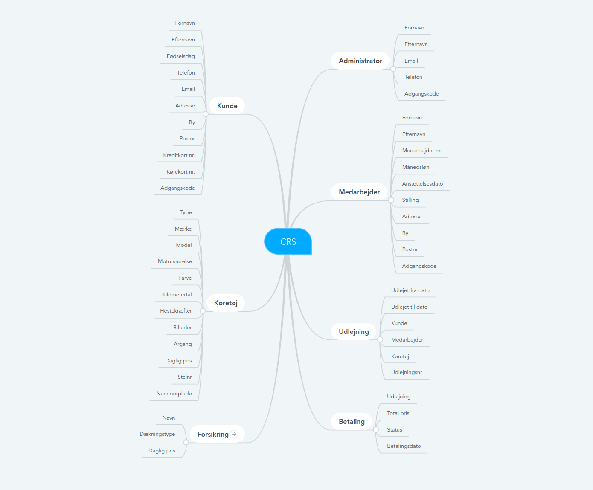
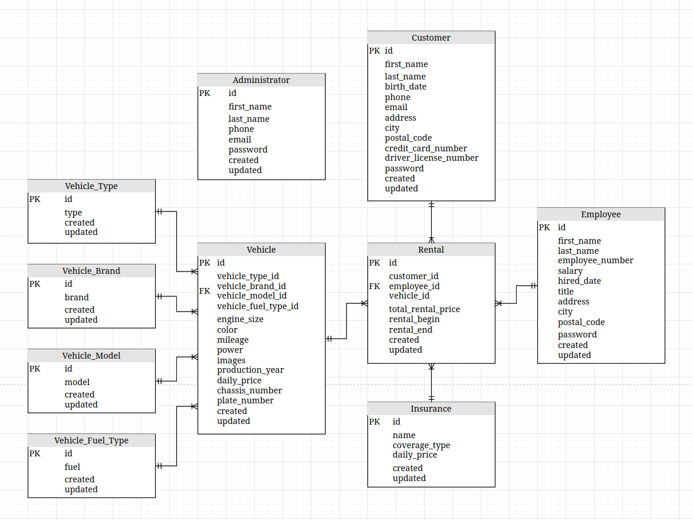

# Car Rental System

"<i>Car Rental System</i>" Lavet i PHP frameworket Laravel, med eget localt miljø i Docker containers bestående af blandt andet MySQL, Selenium, Meilisearch og Laravels eget Sail.

1. [Introduktion](#introduktion)
2. [Opstilling](#opstilling)
3. [Start projektet](#start-projektet)
4. [Udvidelser](#udvidelser)

### Introduktion

Systemet er i første omgang lavet ud fra den idé at der kun er ét udlejningssted. 
Og at alle bilerne hører til her, når ikke de er lejet ud. 
Samt at det er her de skal hentes og returneres ved udlejning.

### Opstilling

<b>Brainstorm:</b><br/>


<b>ER Diagram:</b><br/>


I første omgang skal der laves brugersystem og mulighed for login som bruger, administrator, eller forblive som gæst på sitet, dog uden mulighed for at kunne leje bil.

Derefter indsættes biler samt muliged for at kigge bilerne igennem og se billeder samt specifikationer.

Til sidst udarbejdes muligheden for at en bruger kan leje en bil, og derved blive registreret som lejer. Efter en lejer at betalt, er bilen udlejet og administratioren kan se udlejningen samt at penegne er overført.

<b>Som administrator vil man have følgende muligheder:</b>

   1. User management
   2. Login management
   3. Car management
   4. Booking management
   5. Payment management

### Start projektet

1. Git Clone projektet ned, cd til directory og installer composer packages:

       git clone https://github.com/MichaelAggerholm/CRS.git
       cd CRS
       Composer install

2. .env er med vilje udeladt fra gitignore, da den i dette tilfælde består udelukkende af test data.
Derfor er næste skridt kun at køre dockermiljøet op i detached mode, migrate database, og køre laravels indbyggede webserver:

       ./vendor/bin/sail up -d  (Samme som at køre "docker-compose up -d")
       php artisan migrate
       php artisan serve

3. Nu kører systemet og kan tilgået via localhost port 8000 url:

       http://127.0.0.1:8000/

### Koden
#### soft deletes / cascading soft deletes:
I projektet benyttes der soft deletes på alle tables.
På udvalgte tables bruges der også cascading soft deletes, hvis man sletter et bil brand, eller model osv.. vil bilerne herunder også blive soft deleted.
Dog hvis man sletter en bil, en kunde eller f.eks en sælger, bibeholdes alle udlejninger stadig, da det vil fjerne en vigtig mængde data som bruges til historik, statistik osv.

Måden det gøres på i Laravel, er at benytte et cascade library, i mit tilfælde har jeg valgt "dyrynda", da det er vedligeholdt, opdateres regelmæssigt og har en stor brugergruppe samt altid bestående git tests:
https://github.com/michaeldyrynda/laravel-cascade-soft-deletes

Herefter laver jeg relationer på mine tables, i mit tilfælde er her many delen af en one-to-many relation mellem models og vehicles:
```PHP
public function vehicles(){
    return $this->hasMany(Vehicle::class);
}
```
Derefter tilføjer jeg SoftDeletes og CascadeSoftDeletes til mine usings, samt definere hvilken table der skal køres cascading delete på:
```PHP
use SoftDeletes, CascadeSoftDeletes;

    protected $cascadeDeletes = ['vehicles'];

    protected $table = 'vehicle_models';
```

### Udvidelser
Projektet skal senere hen udbygges til at have flere afdelinger, flere ansatte, og en relations tabel mellem rental og employees for at kunne tracke salg. Samt definere hvilken stilling en ansat har i firmaet.
